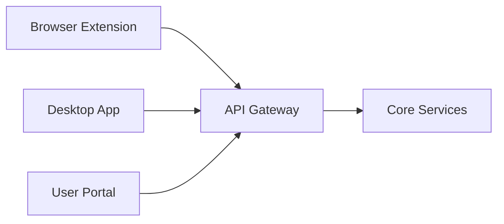

# Project Overview

Welcome to the technical documentation for Terance's core projects. Our system is composed of multiple interconnected components that work together to provide a seamless AI companion experience.

!!! abstract "Quick Overview"

    Terance's architecture is built on four main components that form our complete service ecosystem:
    
    - Browser Extension for web-based interactions
    - API Services for core business logic
    - User Portal for account management
    - Desktop Application for system-level integration

## System Components

---

## Project Overview

Each component in our ecosystem serves a specific purpose and integrates with our core services through a secure API gateway:

### Browser Extension
:material-angular:{ .lg } Built with **Angular**

The browser extension represents the primary interface for web-based interactions, delivering sophisticated real-time AI assistance directly within users' browsers.

Through advanced natural language processing and context awareness, it seamlessly analyzes webpage content and enhances user interactions with intelligent suggestions, content summarization, agentic actions and contextual assistance. 

The extension maintains secure, encrypted communication channels with our core services while ensuring minimal latency and optimal performance. Built with cross-browser compatibility as a fundamental requirement, it supports all major browsers including Chrome, Firefox, Safari and Edge, providing a consistent and intuitive experience across platforms. 

The extension's modular architecture allows for rapid feature deployment and ensures that users always have access to the latest AI capabilities without requiring frequent updates or system restarts.

[:octicons-arrow-right-24: Browser Extension Docs](./browser-extension/index.md)

### API Services
:material-language-python:{ .lg } Built with **Python** and **FastAPI**

At the heart of our ecosystem lies our sophisticated API Services layer, providing a robust, scalable, and highly available foundation for all client interactions. 

This service implements carefully designed RESTful endpoints that handle everything from user authentication and authorization to complex data processing workflows and AI model orchestration. 

It seamlessly integrates with various state-of-the-art AI models via Langchain to provide intelligent responses while orchestrating service communications across our entire platform. 

The API layer maintains strict security protocols through multiple layers of encryption, token-based authentication, and real-time threat detection. Advanced caching mechanisms, load balancing, and horizontal scaling capabilities ensure optimal performance even under heavy load conditions. 

The service also implements comprehensive logging and monitoring solutions, allowing for real-time system health checks and proactive issue resolution.

[:octicons-arrow-right-24: API Documentation](./api-app/index.md)

### User Portal
:material-angular:{ .lg } Built with **Angular**

The User Portal delivers a comprehensive and intuitive web interface that serves as the command center for account management and service customization. Through this sophisticated interface, users can fine-tune their AI assistant preferences, monitor their usage patterns through detailed analytics, and manage their subscription settings with ease. 

The portal provides real-time insights into service utilization through interactive dashboards and visualizations, allowing users to understand and optimize their AI interaction patterns. Users can customize every aspect of their experience through granular profile configurations, from AI response styles to notification preferences. 

The portal's responsive design ensures a seamless experience across devices, while its modular architecture allows for rapid feature additions and updates. Regular user feedback and behavior analysis drive continuous improvements to the interface, ensuring it remains intuitive and efficient for both novice and power users.

[:octicons-arrow-right-24: Portal Documentation](./user-portal/index.md)

### Desktop Application
:material-electron-framework:{ .lg } Built with **Electron**

Our Desktop Application extends AI capabilities beyond the browser, providing deep integration with native operating system features while maintaining enterprise-grade security standards. It operates with sophisticated offline capabilities, leveraging local processing power to maintain productivity even without an internet connection. 

The application's advanced caching and synchronization mechanisms ensure seamless transitions between online and offline modes without data loss. By leveraging system-level access, the application provides enhanced features such as file system integration, global shortcuts, and background processing, while maintaining strict security protocols. 

The desktop client implements sophisticated resource management to minimize system impact while maximizing AI assistant availability. Its modular architecture supports plugin development, allowing for customized integrations with other desktop applications and tools. Regular updates are delivered through a secure auto-update system, ensuring users always have access to the latest features and security improvements while minimizing disruption to their workflow.

[:octicons-arrow-right-24: Desktop App Docs](./desktop-app/index.md)

---

## Development Standards

All projects follow our established development standards:

!!! info "Key Standards"

    - Consistent coding style across all projects
    - Comprehensive test coverage
    - Documentation requirements
    - Security best practices
    - Performance benchmarks

## Getting Started

For developers new to these projects:

1. Set up your development environment using our [setup guide](../engineering/dev-setup.md)
2. Review the [architecture overview](../architecture/overview.md)
3. Follow project-specific setup instructions in each component's documentation
4. Reference our [style guide](../engineering/styleguide/index.md) for coding standards

## Security Considerations

!!! warning "Security First"

    All projects must implement:
    
    - End-to-end encryption
    - Secure authentication
    - Data privacy measures
    - Regular security audits
    - Vulnerability scanning

## Further Resources

-   :material-book-open-page-variant:{ .lg .middle } __Engineering Standards__

    ---

    Review our complete engineering standards and practices

    [:octicons-arrow-right-24: Engineering Standards](../engineering/index.md)

-   :material-cloud-outline:{ .lg .middle } __Deployment Guide__

    ---

    Learn about our deployment processes and infrastructure

    [:octicons-arrow-right-24: Deployment Guide](../deployment/index.md)

